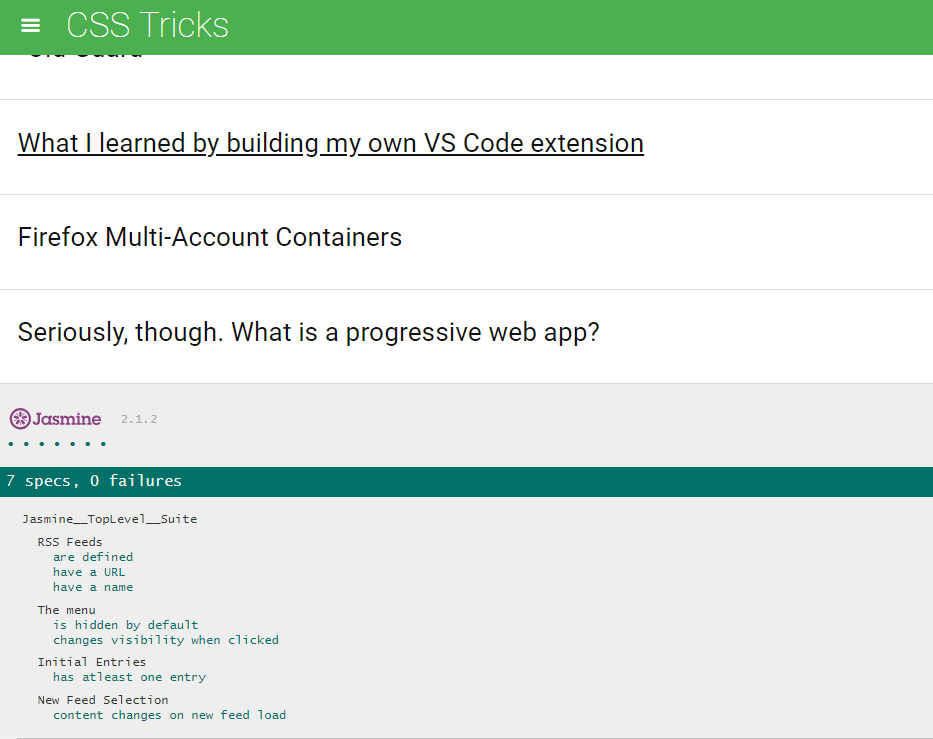

# About

In this project we are given a web-based application that reads RSS feeds by Udacity, CSS Tricks, Html5 Rocks and Linear Digressions. The tests are written using Jasmine to check the features of the code written.

# How to run the Project

1. Clone the repository using
``` bash
 $ git clone https://github.com/strongSoda/feed-reader-testing.git
 ```

2. Open index.html in your browser.

# Implementation Screenshots



# Technologies Used
- Jasmine
- jQuery
- HTML5/CSS3

# Learnings

- Test Driven Development
- Testing Code
- Jasmine Framework